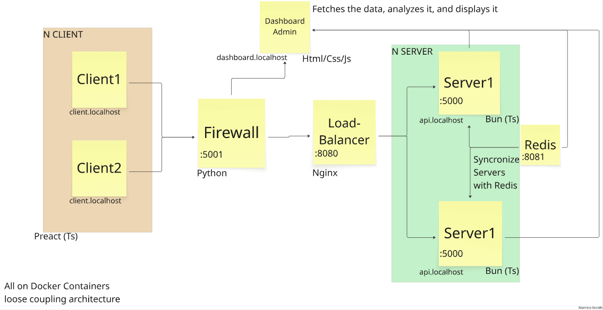

# Network Security Infrastructure Project

A comprehensive Docker-based network security infrastructure implementing multiple security layers and monitoring capabilities.
# License

This project is licensed under the MIT License - see the LICENSE file for details.
## Architecture Overview

This project implements a complete network security infrastructure with the following components:

- **NGINX Reverse Proxy**: Load balances requests between two backend servers
- **Backend Servers**: Two Python Flask servers (server1 & server2) handling requests
- **Programmable Firewall**: Custom rule-based traffic filtering
- **File Receiver**: Network service for secure file uploads
- **Python Client**: Command-line tool for sending files and messages
- **Dashboard**: Real-time network monitoring interface (in development)
- **Web-client**: Web client for sending files and messages (in development)
The system supports HTTP communication for text messages and uses Docker Compose for container orchestration with bridge networking.


## Prerequisites

- **Docker**: >= 20.x
- **Docker Compose**: >= 1.29.x  
- **Python**: >= 3.8 (for manual client execution)

## Quick Start

### 1. Clone and Setup

```bash
git clone https://github.com/Nick-Maro/docker-mini-network
cd docker-mini-network
```

### 2. Build and Deploy

```bash
# Build all containers
docker compose build

# Start services in background
docker compose up -d

# Verify all containers are running
docker compose ps
```

### 3. Test the Setup

```bash
# Test backend connectivity
curl -X POST http://127.0.0.1:5001/command -H "Content-Type: application/json" -d "{\"command\":\"ciao\"}"
```

## Container Architecture

| Service | Description | Port | Purpose |
|---------|-------------|------|---------|
| `reverse-proxy` | NGINX load balancer | 8080 | Routes traffic to backends |
| `server1` | Python Flask backend | 5000 | Primary application server |
| `server2` | Python Flask backend | 5000 | Secondary application server |
| `firewall` | Custom traffic filter | 5001 | Rule-based traffic filtering |
| `file-receiver` | File upload service | - | Secure file handling |
| `client` | Python sender script | - | Testing and communication |
| `dashboard` | Monitoring interface | 8000 | System visualization |
| `redis` | in-memory database | 8081 | Database |

## Client Commands Reference

### Interactive Commands

Once connected to the client interface, you can use the following commands:

| Command | Arguments | Description |
|---------|-----------|-------------|
| `j <room_name>` | room name (string) | Join (or create) a room |
| `s <message>` | message (string) | Send message to the current room |
| `p <client_id> <msg>` | client UUID + message | Send **private message** to a specific client (use full ID from `c` command) |
| `r` | — | Read all messages from the current room |
| `pm` | — | Read all **private messages** |
| `l` | — | List all available rooms |
| `c` | — | List all connected clients (with **full IDs**) |
| `e` | — | Leave the current room |
| `h` | — | Show help menu |
| `q` | — | Quit the program |

### Example Usage

```bash
# Join a room
j general

# Send a message to the room
s Hello everyone!

# Send a private message to a specific client
p a1b2c3d4-e5f6-7890-abcd-ef1234567890 Private hello!

# List all connected clients
c

# Read room messages
r

# Check private messages
pm

# List available rooms
l

# Leave current room
e

# Quit the application
q
```

## Using the Client

### Interactive Mode

```bash
cd client
python sender.py
```

Follow the prompts:
1. **Host**: Enter `localhost` (or remote IP)
2. **Port**: Enter `5001` 
3. **Action**: Choose:
   - `f` - Send a file (provide full path)
   - `m` - Send a text message
   - `q` - Quit

### Programmatic Usage

```python
# Example: Send a message
python sender.py --host localhost --port 5001 --message "Hello Server"

# Example: Send a file
python sender.py --host localhost --port 5001 --file "/path/to/file.txt"
```

## Configuration

### Firewall Rules

Rules are defined in `rules.json` and managed via:
- `firewall.py` - Core filtering logic
- `fwcli.py` - Command-line interface

## Monitoring and Logs

### Container Logs

```bash
# View all logs in real-time
docker compose logs -f

# View specific container logs
docker compose logs -f reverse-proxy
docker compose logs -f server1

# View logs with timestamps
docker compose logs -f -t
```

### NGINX Logs

```bash
# Access NGINX container
docker exec -it <reverse-proxy-container-id> /bin/bash

# View access logs
tail -f /var/log/nginx/access.log

# View error logs
tail -f /var/log/nginx/error.log
```

## Useful Docker Commands

```bash
# Start services (foreground)
docker compose up

# Start services (background)
docker compose up -d

# Rebuild containers
docker compose build --no-cache

# Stop and remove containers
docker compose down

# Remove containers and volumes
docker compose down -v

# View container status
docker compose ps

# Scale backend servers
docker compose up -d --scale server1=2 --scale server2=2

# Execute commands in containers
docker exec -it <container-name> /bin/bash
```

## Development Roadmap

### Critical Issues & Code Quality
- [ ] **Code Refactoring**
  - Clean up codebase structure
  - Improve code documentation
  - Standardize coding conventions
  - Remove redundant code

- [ ] **Client Bug Fixes**
  - Fix ability to send messages without joining a room
  - Resolve connection drops and stability issues
  - Improve error handling and reconnection logic
  - Add input validation and sanitization

- [ ] **Internationalization**
  - Translate all text content to English
  - Standardize language across all components

### User Interface & Experience
- [ ] **Web Client Integration**
  - Connect index.html web client to backend client
  - Implement real-time web interface
  - Add responsive design for mobile devices

- [ ] **Private Groups System**
  - Implement private group creation and management
  - Add invitation-based group access
  - Group-specific permissions and moderation
  - Private group encryption and security

### Communication & Media
- [ ] **Voice Communication**
  - Implement UDP-based voice transmission
  - Real-time audio streaming capabilities
  - Voice chat rooms and private calls
  - Audio codec optimization for low latency

- [ ] **File Transfer Implementation**
  - Enhanced file sharing within groups
  - File encryption during transmission
  - Support for multiple file formats
  - File versioning and history

### Security & Cryptography
- [ ] **End-to-End Encryption**
  - Implement message encryption/decryption
  - Generate RSA or AES key pairs for users
  - Secure key exchange protocols
  - Message integrity verification

- [ ] **User Authentication System**
  - Password-based user registration
  - Private key encryption with user password
  - Secure password hashing (bcrypt/scrypt)
  - Session management and token authentication

- [ ] **Network Security Hardening**
  - Port security and access control
  - Network segmentation and isolation
  - Container security best practices
  - TLS/SSL certificate management (?)

- [ ] **Advanced Firewall**
  - Enhanced rule-based filtering
  - DDoS protection mechanisms
  - Intrusion detection and prevention
  - Real-time threat monitoring
  - Automated security response

### Infrastructure & Performance
- [ ] **TLS/SSL Integration**
  - HTTPS endpoint configuration
  - SSL certificate automation
  - Secure WebSocket connections

- [ ] **Protocol Extensions**
  - WebSocket support for real-time communication
  - UDP protocol implementation for voice and real-time data
  - file trasfer implementation 

- [ ] **Logging & Monitoring**
  - Implement log rotation for NGINX

- [ ] **Dashboard Enhancements**
  - Cache monitoring and visualization

- [ ] **Production Features**
  - Performance monitoring and optimization


**⚠️ Security Notice**: This is a development/educational project. For production use, ensure proper security hardening, regular updates, and professional security review.