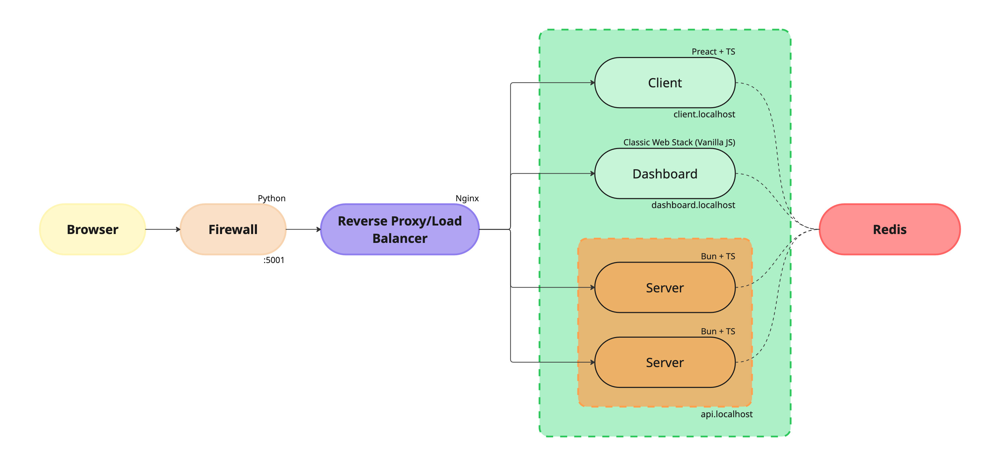

# Network Security Infrastructure Project
A comprehensive Docker-based network security infrastructure implementing multiple security layers and monitoring capabilities.

> [!WARNING]  
> Use responsibly and only on networks you own or have permission to analyze. Misuse of this tool may violate laws or terms of service.


## Prerequisites
- **Docker**: >= 20.x
- **Docker Compose**: >= 1.29.x


## Quick Start
### 1. Clone and Setup
```bash
git clone https://github.com/Nick-Maro/docker-mini-network
cd docker-mini-network
```

### 2. Build and Deploy
```bash
# Build and start all containers in background
docker compose up --build -d

# Verify all containers are running
docker compose ps
```


## Configurations
### Host File Setup
**Important**: Before starting the project, you must configure your system's hosts file to enable subdomain routing.

Add the following entries to your hosts file:
**Windows**: Edit `C:\Windows\System32\drivers\etc\hosts`
**Linux/macOS**: Edit `/etc/hosts`

```plaintext
127.0.0.1 client.localhost
127.0.0.1 dashboard.localhost
127.0.0.1 api.localhost
```

### Useful Docker Commands
```bash
docker compose up                       # Start services (foreground)
docker compose up -d                    # Start services (background)
docker compose build --no-cache         # Rebuild containers
docker compose down                     # Stop and remove containers
docker compose down -v                  # Remove containers and volumes
docker compose ps                       # View container status
docker compose up -d --scale server1=2  # Scale backend servers
```

## Architecture Overview
This project implements a complete network security infrastructure with the following components:
- **NGINX Reverse Proxy**: Load balances requests between two backend servers
- **Backend Server**: Two TypeScript Bun servers handling requests
- **Programmable Firewall**: Custom rule-based traffic filtering
- **Dashboard**: Real-time network monitoring interface
- **Web-client**: Web client for sending files and messages (in development)
The system supports HTTP communication for text messages and uses Docker Compose for container orchestration with bridge networking.



## Container Architecture
| Service         | Description                             | URL                   | Purpose                                                |
| --------------- | --------------------------------------- | --------------------- | ------------------------------------------------------ |
| `reverse-proxy` | NGINX reverse proxy (subdomain routing) | -                     | Routes traffic to internal services based on subdomain |
| `server`        | Bun + TS backend                        | `api.localhost`       | Primary application server                             |
| `firewall`      | Custom traffic filter                   | -                     | Rule-based traffic filtering                           |
| `client`        | Web client (Preact + TS)                | `client.localhost`    | Main user interface                                    |
| `dashboard`     | Monitoring web interface                | `dashboard.localhost` | System monitoring and management                       |
| `redis`         | In-memory key-value database            | -                     | Internal data storage / caching                        |


## License
This project is licensed under the MIT License - see the [LICENSE](LICENSE) file for details.

**⚠️ Security Notice**: This is a development/educational project. For production use, ensure proper security hardening, regular updates, and professional security review.