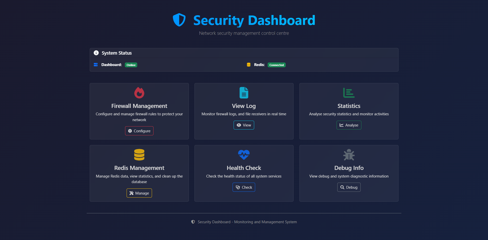
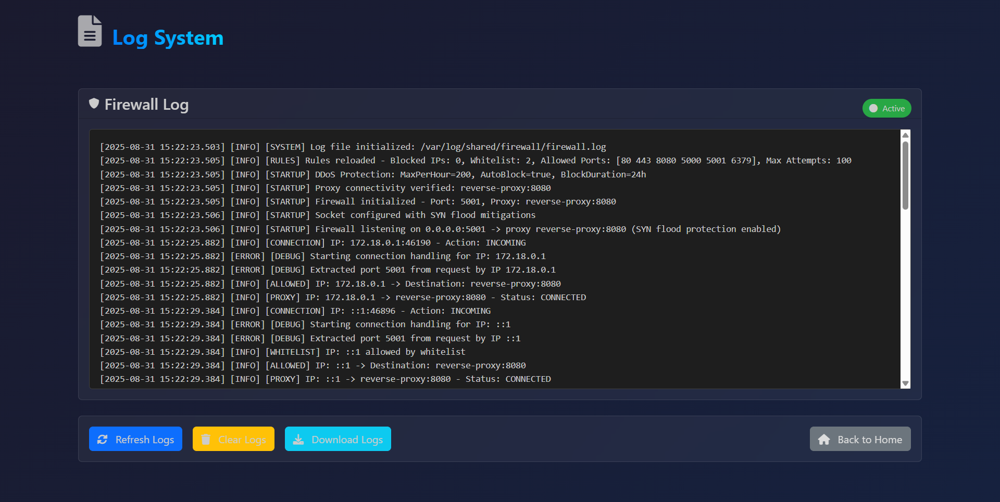
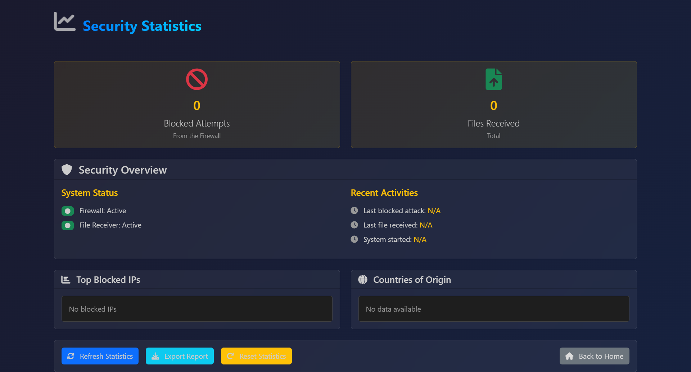
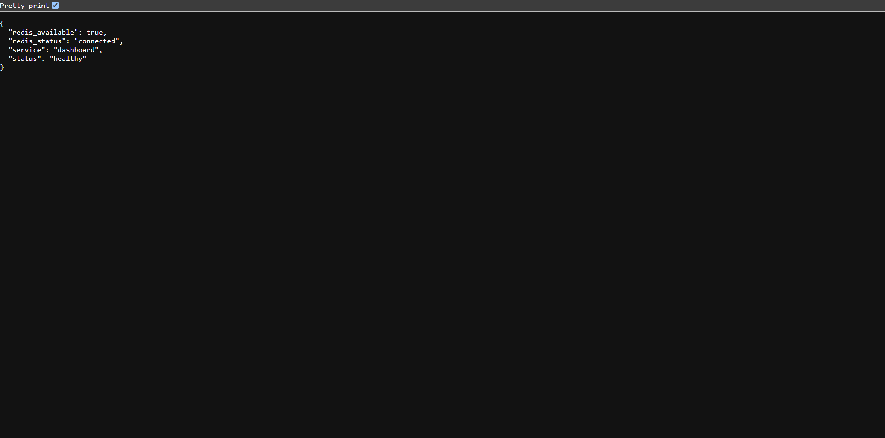
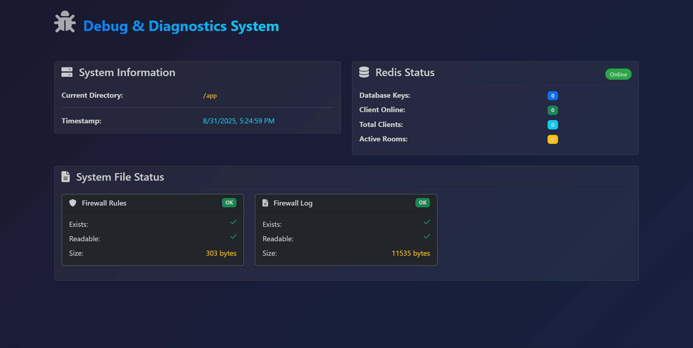

## Core Features

### System Overview (`app.py`)
- Real-time system status monitoring
- Redis connectivity and health checks
- Service availability indicators
- Automated refresh every 5 minutes

### Firewall Management (`/firewall`)


- JSON-based rule configuration
- Real-time rule validation and updates
- Rule persistence with automatic backup
- Default rule templates for quick setup

### Redis Management (`/redis`)


- Complete Redis data visualization
- Client, room, and message statistics
- Bulk data operations (clear clients, rooms, messages)
- JSON export functionality for backup
- Danger zone with confirmation dialogs

### Log Monitoring (`/logs`)



- Real-time firewall log viewing
- Log filtering and search capabilities
- Download and export functions
- Automatic log rotation

### Statistics Dashboard (`/stats`)



- Security metrics and analytics
- Blocked attempts tracking
- File transfer statistics
- Top blocked IPs analysis
- Geographic origin tracking

## Dashboard Routes

```python
@app.route("/")                    # Main dashboard
@app.route("/firewall")            # Firewall rule management
@app.route("/redis")               # Redis data management
@app.route("/logs")                # Log viewer
@app.route("/stats")               # Security statistics
@app.route("/health")              # Health check API
@app.route("/debug")               # System diagnostics
@app.route("/redis/clear")         # Redis cleanup operations
@app.route("/redis/export")        # Data export API
```

## Configuration

### Environment Variables
```python
REDIS_HOST = os.getenv('REDIS_HOST', 'redis')
REDIS_PORT = int(os.getenv('REDIS_PORT', 6379))
REDIS_DB = int(os.getenv('REDIS_DB', 0))
REDIS_PASSWORD = os.getenv('REDIS_PASSWORD', None)
```

### File Paths
```python
FIREWALL_RULES_PATH = "/var/log/shared/firewall/rules.json"
FIREWALL_LOG_PATH = "/var/log/shared/firewall/firewall.log"
```

## UI Components

### Modern Dark Theme
- **Bootstrap 5**: Responsive grid system and components
- **FontAwesome 6**: Comprehensive icon library
- **Custom CSS**: Dark theme with glassmorphism effects
- **Animations**: Smooth transitions and hover effects

### Dashboard Cards
```css
.card-custom {
    background: rgba(255, 255, 255, 0.05);
    backdrop-filter: blur(10px);
    border: 1px solid rgba(255, 255, 255, 0.1);
    transition: transform 0.3s ease, box-shadow 0.3s ease;
}

.card-custom:hover {
    transform: translateY(-5px);
    box-shadow: 0 10px 25px rgba(0, 0, 0, 0.3);
}
```

### Status Indicators
- **Online/Offline Badges**: Real-time service status
- **Color-coded Metrics**: Green (good), Yellow (warning), Red (critical)
- **Progress Indicators**: Loading states for operations
- **Auto-refresh Timers**: Configurable refresh intervals

## Redis Management Features

### Data Visualization
```python
def get_redis_data():
    # Clients
    clients_keys = redis_client.keys("client:*")
    clients = {key.split("client:")[1]: fetch_json(key) for key in clients_keys}

    # Rooms
    rooms_keys = redis_client.keys("room:*")
    rooms = {key.split("room:")[1]: fetch_json(key) for key in rooms_keys}

    # Private messages
    pm_keys = redis_client.keys("pm:*")
    private_messages = {key: fetch_json(key) for key in pm_keys}

    return {
        'clients': clients,
        'rooms': rooms,
        'private_messages': private_messages
    }
```

### Statistics Calculation
```python
def get_redis_stats():
    data = get_redis_data()

    # Calculate online clients based on last_seen timestamp
    online_clients = 0
    for client_data in data.get('clients', {}).values():
        if client_data.get('last_seen'):
            last_seen = datetime.fromisoformat(client_data['last_seen'])
            if datetime.now(timezone.utc) - last_seen <= timedelta(hours=1):
                online_clients += 1

    return {
        "total_clients": len(data.get('clients', {})),
        "online_clients": online_clients,
        "total_rooms": len(data.get('rooms', {})),
        "total_private_messages": len(data.get('private_messages', {}))
    }
```

### Bulk Operations
- **Clear All Data**: Complete database flush
- **Selective Cleanup**: Clear specific data types (clients, rooms, messages)
- **Confirmation Dialogs**: Modal confirmations for destructive operations
- **Progress Indicators**: Visual feedback during operations

## Security Features

### Data Protection
- Safe JSON parsing with error handling
- Input validation for all form submissions
- File permission checks before operations
- Atomic operations for Redis modifications

### User Interface Security
- CSRF protection with Flask secret key
- Content Security Policy headers
- XSS protection with proper escaping
- Rate limiting on sensitive operations

## Health Monitoring



### Health Check API
```python
@app.route("/health")
def health():
    health_status = {
        "status": "healthy",
        "service": "dashboard",
        "redis_available": REDIS_AVAILABLE
    }

    if REDIS_AVAILABLE:
        try:
            redis_client.ping()
            health_status["redis_status"] = "connected"
        except RedisError:
            health_status["redis_status"] = "disconnected"
            health_status["status"] = "degraded"

    return jsonify(health_status)
```

### Debug Information



```python
@app.route("/debug")
def debug():
    debug_info = {
        "current_directory": os.getcwd(),
        "firewall_rules_exists": os.path.exists(FIREWALL_RULES_PATH),
        "firewall_log_exists": os.path.exists(FIREWALL_LOG_PATH),
        "redis_available": REDIS_AVAILABLE,
    }
    return render_template('debug.html', debug_info=debug_info)
```

## Docker Configuration

### Dockerfile
```dockerfile
FROM python:3.11-alpine

WORKDIR /app

RUN apk add --no-cache curl && \
    mkdir -p /var/log/shared/firewall && \
    chmod -R 777 /var/log/shared

COPY requirements.txt ./
RUN pip install --no-cache-dir -r requirements.txt

COPY . .

EXPOSE 80
CMD ["python", "app.py"]
```

### Dependencies
```
Flask==2.3.2
redis==4.5.4
python-dotenv==1.1.1
```

## JavaScript Functionality

### Auto-refresh Mechanisms
```javascript
// Main dashboard auto-refresh (5 minutes)
setTimeout(function() {
    location.reload();
}, 300000);

// Statistics auto-refresh (1 minute)
setInterval(refreshStats, 60000);

// Real-time clock update
function updateCurrentTime() {
    document.getElementById('current-time').textContent = new Date().toLocaleString();
}
setInterval(updateCurrentTime, 1000);
```

### Modal Confirmations
```javascript
// Dangerous operations require confirmation
document.querySelectorAll('[data-action]').forEach(button => {
    button.addEventListener('click', function() {
        currentAction = this.dataset.action;
        confirmText.textContent = actionTexts[currentAction];
        confirmModal.show();
    });
});
```

## Development & Debugging

### Local Development
```bash
# Install dependencies
pip install -r requirements.txt

# Run development server
python app.py

# Debug mode
FLASK_DEBUG=1 python app.py
```

### Container Development
```bash
# Build and run dashboard
docker compose up dashboard --build

# View dashboard logs
docker compose logs -f dashboard

# Access dashboard shell
docker compose exec dashboard sh
```

### Template Structure
```
templates/
├── index.html          # Main dashboard page
├── firewall.html       # Firewall management
├── redis.html          # Redis management
├── logs.html           # Log viewer
├── stats.html          # Statistics dashboard
└── debug.html          # Debug information
```