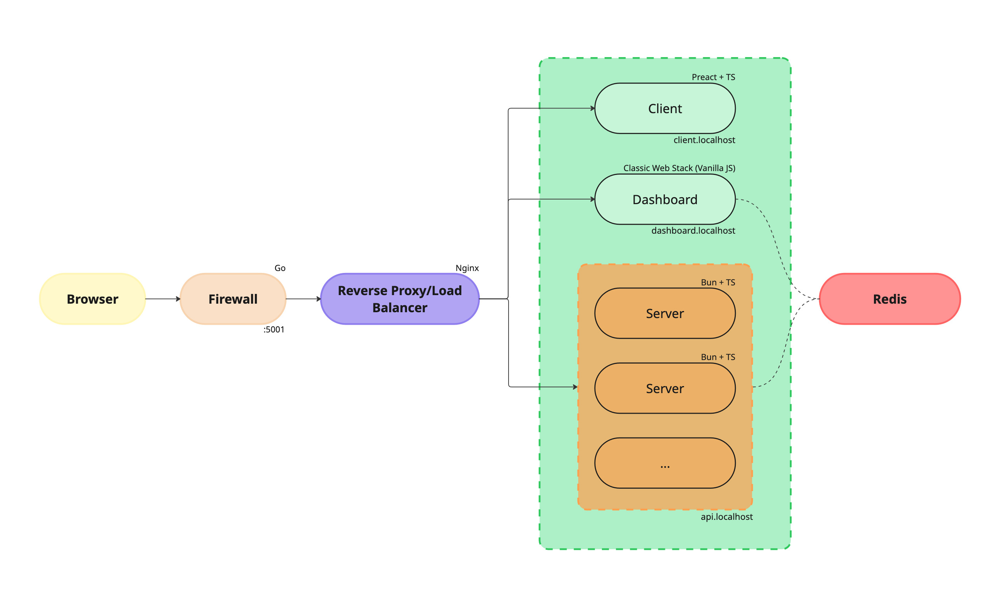

> **⚠️ Security Notice**: This is a development/educational project. Use responsibly and only on networks you own or have permission to analyze. Misuse of this tool may violate laws or terms of service.

## Quick Start

### Prerequisites
- **[Docker](https://www.docker.com/)**: >= 20.x
- **[Docker Compose](https://docs.docker.com/compose/)**: >= 1.29.x

### Setup and Deployment

```bash
# Clone the repository
git clone https://github.com/Nick-Maro/docker-mini-network
cd docker-mini-network

# Build and start all containers
docker compose up --build -d

# Verify all containers are running
docker compose ps
```

### Host Configuration

Before starting the project, configure your system's hosts file:

**Windows**: Edit `C:\Windows\System32\drivers\etc\hosts`
**Linux/macOS**: Edit `/etc/hosts`

```
127.0.0.1 client.localhost
127.0.0.1 dashboard.localhost
127.0.0.1 api.localhost
```

## Architecture Overview

### System Components

| Service | Description | URL | Purpose |
|---------|-------------|-----|---------|
| `reverse-proxy` | NGINX reverse proxy with subdomain routing | - | Routes traffic to internal services |
| `server` | Bun + TypeScript backend (scalable) | `api.localhost` | Primary application server |
| `firewall` | Go-based programmable traffic filter | - | Advanced DDoS protection and rule-based filtering |
| `client` | Web client (Preact + TypeScript) | `client.localhost` | Main user interface |
| `dashboard` | Flask-based monitoring interface | `dashboard.localhost` | System monitoring, Redis management, and firewall control |
| `redis` | In-memory key-value database | - | Caching and data storage |

### Network Architecture

The system implements a multi-layered security architecture:
- **Load Balancing**: NGINX reverse proxy distributes requests across backend instances
- **Encryption**: RSA + ECDH cryptographic authentication
- **Session Management**: Secure WebSocket sessions with nonce-based replay protection
- **Data Persistence**: Redis for distributed storage with local fallback
- **Real-time Communication**: WebSocket-based messaging with pub/sub patterns



## Documentation Structure

- [Backend Server](./backend/backend-servers.mdx) - Core application server architecture
- [Dashboard](./frontend/dashboard.mdx) - Web-based monitoring and management interface
- [Firewall](./firewall/firewall.mdx) - Programmable traffic filtering and DDoS protection
- [Security](./security/cryptography.mdx) - Cryptographic authentication and session management
- [API Reference](./api/websocket.mdx) - Complete WebSocket protocol documentation
- [Deployment](./deployment/deployment.mdx) - Production deployment and scaling guide
- [Troubleshooting](./troubleshooting/troubleshooting.mdx) - Common issues and debugging guide

## License

This project is licensed under the MIT License. See the LICENSE file for details.

---

*Last updated: August 31, 2025*